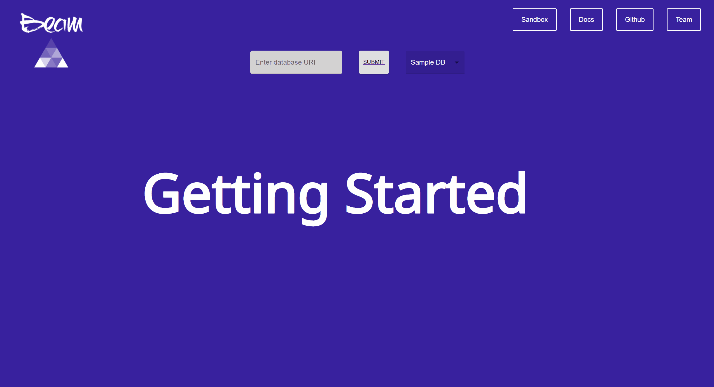

# BeamQL
Seamlessly visualize your PostgreSQL database and transform your REST API into GraphQL in less than 15 minutes.
Live demo [_here_](https://www.beamql.com). 

## Table of Contents
* [General Info](#general-information)
* [Technologies Used](#technologies-used)
* [Features](#features)
* [Screenshots](#screenshots)
* [Usage](#usage)
* [To Do](#to-do)
* [Acknowledgements](#acknowledgements)
* [Contributors](#contact)

## General Information
- BeamQL is on a mission to improve developers' workflow by helping them visualize their databases and transform their REST APIs to GraphQL.

## Technologies Used
- React.js (React Hooks) - version 17.0.2
- React-flow-renderer - version 5.2.0
- axios - version 0.21.1
- Express - version 4.17.1
- jest - version 27.1.0
- supertest - version 6.1.6
- Docker
- AWS
- Travis.ci

## Features
- Visualize user's PostgreSQL database by instantly creating an entity relationship diagram
- Generate GraphQL complete type schema
- Create GraphQL all resolvers

## Screenshots

<!-- If you have screenshots you'd like to share, include them here. -->

## Usage
1. Copy your PostgreSQL database URI into [beamql.com](www.beamql.com).
2. View and interact with the graphical visualization of the database and use it in API documentation to give users a better understanding of what they are working with.
3. Open NodeJS backend codebase in a code editor.
4. Use the schema and resolvers that BeamQL produces with [Apollo Server](https://www.npmjs.com/package/apollo-server-express) or a similar GraphQL server that suits your Node.js server.
5. Start server and navigate to localhost:X000/graphql
6. Behold the glory of your database accessible through the query language of the future!

## To Do
- Convert to typescript
- Add support for all PostgreSQL data types
- Integrate GraphiQL so user's can test their endpoints with the generated schema and resolvers

## Acknowledgements
- Many thanks to OSLabs for accepting us into the tech accelerator and providing amazing support throughout this whole process.

## Contributors
[Adam Goodman](https://www.linkedin.com/in/adam-goodman1/)
[Brian Grosso](https://www.linkedin.com/in/newarkbg/)
[Eric Askew](https://www.linkedin.com/in/eric-askew-8a91714a/)
[Mark Liu](https://www.linkedin.com/in/markyliu1/)

